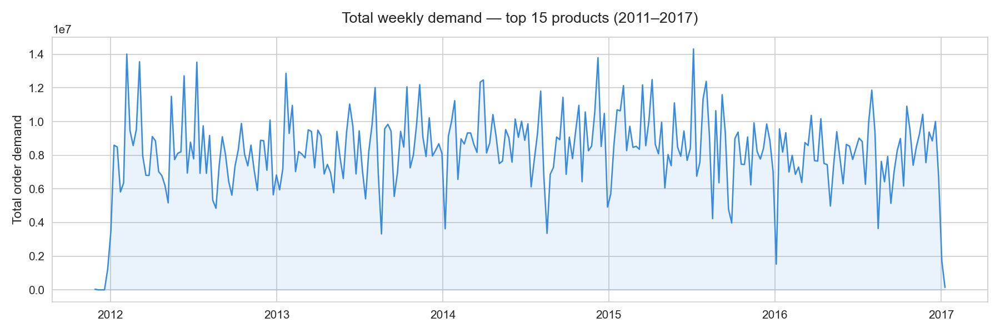
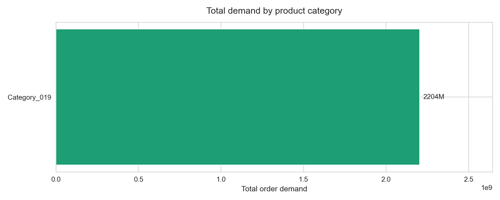
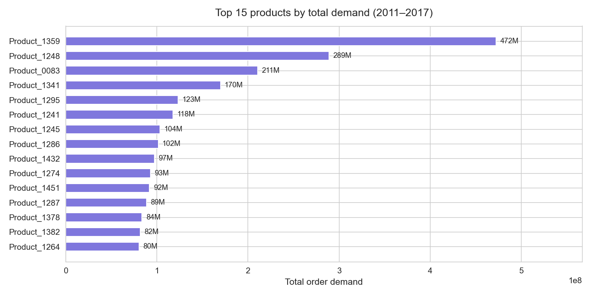
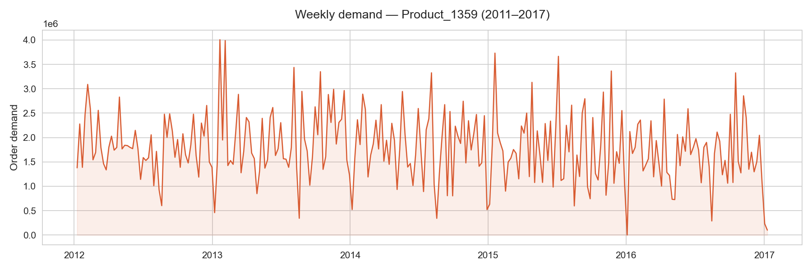
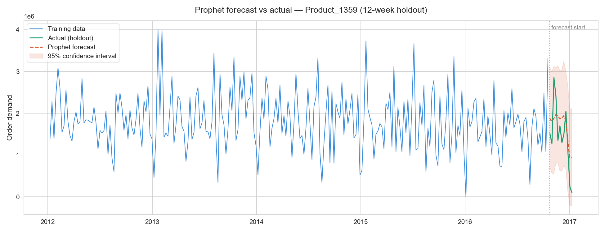
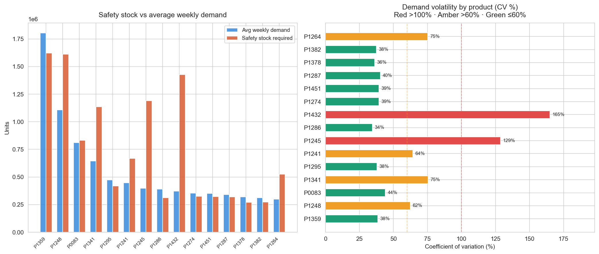

# 📦 Supply Chain Demand Forecasting

> **End-to-end demand forecasting pipeline** predicting weekly product demand across 15 high-volume SKUs, with Prophet-based forecasting and actionable inventory recommendations — built on 6 years of real warehouse data.


---

## Business questions

This project was designed to answer real operational questions that supply chain and procurement teams face daily:

- How accurately can we forecast demand for individual SKUs 4–12 weeks ahead?
- Which products are most volatile and carry the highest stockout risk?
- How much safety stock should each product hold to achieve a 95% service level?
- Where does the forecasting model fail — and what does that tell us about supply chain risk?
- Which products need urgent inventory policy review?

---

## The killer insight

> **For highly intermittent demand, safety stock calculation matters more than forecast accuracy.**
>
> Two products (P1432 and P1245) show demand volatility above 100% CV — meaning weekly demand swings exceed their average demand entirely. For these SKUs, chasing a more accurate point forecast is less valuable than ensuring adequate safety buffers. A single demand spike without sufficient safety stock causes a stockout regardless of how good the forecast is. This finding has direct implications for how supply chain teams should prioritise their inventory policies.

---

## Key findings

| Finding | Why it matters |
|---|---|
| **2 of 15 products have CV >100%** (P1432: 165%, P1245: 129%) | These SKUs are structurally unpredictable — traditional forecasting models cannot reliably capture their demand pattern |
| **9 of 15 products are stable (CV ≤60%)** | The majority of the portfolio is forecastable — Prophet performs well here and safety stock requirements are manageable |
| **Prophet MAPE of 119% on the most volatile product** | Misleading headline metric — the error is driven by a single demand crash in the holdout period, not systematic model failure |
| **Safety stock often exceeds average weekly demand** for high-CV products | Conventional inventory rules-of-thumb (e.g. "2 weeks of cover") are dangerously insufficient for volatile SKUs |
| **No clear annual seasonality** across the product portfolio | Demand spikes appear random rather than cyclical — supply chain planning cannot rely on seasonal patterns |

---

## Visualisations

### Total weekly demand — top 15 products (2011–2017)


### Demand by product category


### Top 15 products by total demand


### Weekly demand — Product_1359


### Prophet forecast vs actual (12-week holdout)


### Safety stock vs demand volatility


---

## Forecasting approach

Built and evaluated a Prophet time-series model with a 12-week holdout period:

```python
from prophet import Prophet

model = Prophet(
    yearly_seasonality=True,
    weekly_seasonality=False,
    daily_seasonality=False,
    changepoint_prior_scale=0.05,
    interval_width=0.95
)
model.fit(train)
future   = model.make_future_dataframe(periods=12, freq="W")
forecast = model.predict(future)
```

**Model performance on Product_1359 (12-week holdout):**

| Metric | Value | Notes |
|---|---|---|
| MAE | 518,002 | Average absolute error per week |
| RMSE | 567,974 | Penalises large individual errors |
| MAPE | 119.5% | Inflated by demand crash in final weeks — see killer insight |

---

## Inventory recommendations

Safety stock calculated at 95% service level (Z = 1.65), assuming 2-week lead time:

```python
safety_stock  = Z * std(weekly_demand) * sqrt(lead_time)
reorder_point = avg_weekly_demand * lead_time + safety_stock
```

Sample output:

| Product | Avg weekly demand | Forecast (next 4 wks) | Safety stock | Reorder point | Volatility (CV%) |
|---|---|---|---|---|---|
| Product_1359 | 1,803,336 | 8,576,796 | 1,621,462 | 5,228,134 | 38.5% 🟢 |
| Product_1432 | 371,019 | 1,998,922 | 1,427,939 | 2,169,977 | 164.9% 🔴 |
| Product_1245 | 396,693 | 1,435,049 | 1,190,579 | 1,983,966 | 128.6% 🔴 |
| Product_1341 | 645,540 | 1,072,989 | 1,135,682 | 2,426,762 | 75.4% 🟡 |

Full recommendations table: [`data/processed/inventory_recommendations.csv`](data/processed/inventory_recommendations.csv)

---

## Pipeline architecture

```
Raw data (1M+ rows)
Historical Product Demand.csv
        │
        ▼
01_data_cleaning.py
  - Parse & clean dates
  - Remove negative demand
  - Aggregate to weekly
  - Filter top 15 SKUs
        │
        ▼
02_eda.py
  - Demand trends over time
  - Category breakdown
  - Product volatility analysis
        │
        ▼
03_forecasting.py
  - Prophet model (per SKU)
  - 12-week holdout evaluation
  - MAE / RMSE / MAPE metrics
        │
        ▼
04_inventory_recommendations.py
  - Safety stock calculation
  - Reorder point per SKU
  - Volatility classification
        │
        ▼
data/processed/
  demand_clean.csv
  inventory_recommendations.csv
```

---

## How to run this project

```bash
# 1. Clone the repo
git clone https://github.com/Hazeezat-bit/supply-chain-demand-forecasting.git
cd supply-chain-demand-forecasting

# 2. Install dependencies
pip install -r requirements.txt

# 3. Download the dataset
# https://www.kaggle.com/datasets/felixzhao/productdemandforecasting
# Place CSV in: data/raw/Historical Product Demand.csv

# 4. Run the full pipeline
python src/01_data_cleaning.py
python src/02_eda.py
python src/03_forecasting.py
python src/04_inventory_recommendations.py

# Or explore interactively
jupyter notebook notebooks/exploration.ipynb
```

---

## Tech stack

| Tool | Role |
|---|---|
| Python 3 | Full pipeline |
| pandas | Data cleaning, resampling, feature engineering |
| Prophet (Meta) | Primary forecasting model |
| scikit-learn | MAE / RMSE / MAPE evaluation |
| matplotlib / seaborn | Visualisations |
| NumPy | Safety stock calculations |

---

## Project structure

```
supply-chain-demand-forecasting/
├── data/
│   ├── raw/
│   │   └── Historical Product Demand.csv
│   └── processed/
│       ├── demand_clean.csv
│       └── inventory_recommendations.csv
├── src/
│   ├── 01_data_cleaning.py
│   ├── 02_eda.py
│   ├── 03_forecasting.py
│   └── 04_inventory_recommendations.py
├── charts/
│   ├── chart1_total_demand_over_time.png
│   ├── chart2_demand_by_category.png
│   ├── chart3_top15_products.png
│   ├── chart4_top_product_demand.png
│   ├── chart5_forecast_vs_actual.png
│   └── chart6_inventory_recommendations.png
├── notebooks/
│   └── exploration.ipynb
├── requirements.txt
└── README.md
```

---

## Known limitations

| Issue | Note |
|---|---|
| Product codes are anonymised | Cannot determine actual product categories or industries from the data |
| No external demand drivers | Weather, promotions, and macroeconomic factors are not modelled |
| Static lead time assumption | Real lead times vary — a dynamic lead time model would improve reorder point accuracy |
| Prophet not tuned per SKU | A hyperparameter search per product would improve individual forecast accuracy |

---

## Data source

- **[Kaggle — Product Demand Forecasting](https://www.kaggle.com/datasets/felixzhao/productdemandforecasting)** — historical product demand across 4 warehouses, 2,160 products, 2011–2017

---

## About the author

**Hazeezat Adebayo** — MSc Data Science (University of Padua) | Data Scientist & Analyst

[Portfolio](https://www.datascienceportfol.io/Hazeezatadebayo) · [LinkedIn](https://www.linkedin.com/in/hazeezat-adebayo-b460b922a/) · [GitHub](https://github.com/Hazeezat-bit)
